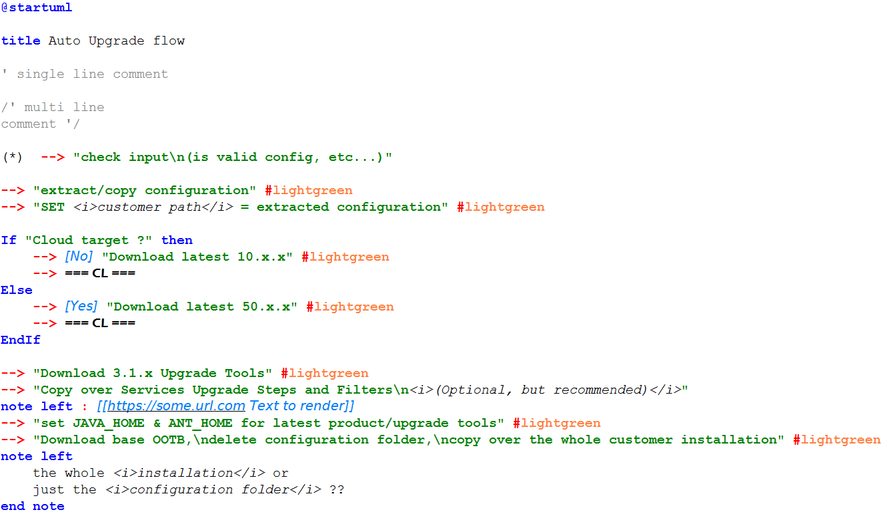

# A Notepad++ UDL for PlantUML language
_(this codebase is based on: https://github.com/brianmaher84/PlantUML_Notepad-_UDL)_

This project contains a User Definied Language (UDL) for Notepad++ to support PlantUML language syntax.
It is not a perfect solution as UDL does not support regexes so some PlantUML constructs could not be matched.

### Rendered Examples

-----------------------------------------

-----------------------------------------

-----------------------------------------

-----------------------------------------

#### How to import a UDL into your Notepad++:
https://npp-user-manual.org/docs/user-defined-language-system/#import-a-udl
